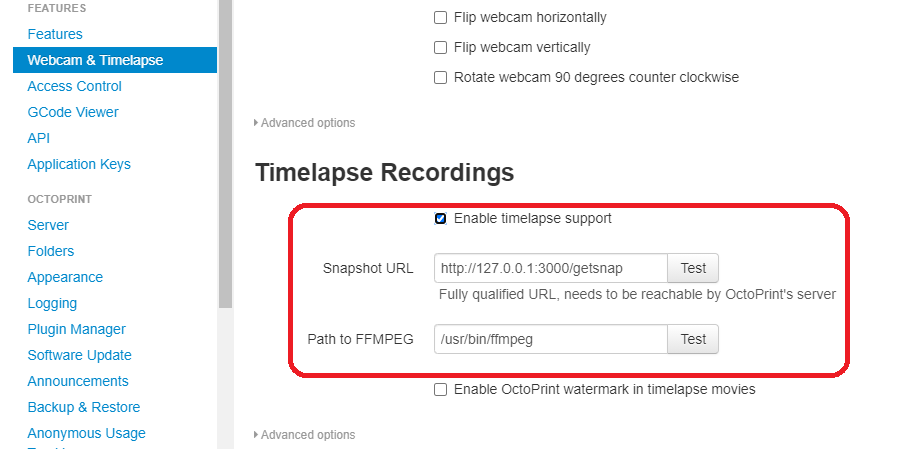

# RPI-Octoprint-timelapse
This project offers a web cam server to Octoprint service. So it can make timelapses.

## requirements

    - Octoprint installed
    - USB CAM

## install

1. Connect usb cam.
2. Make sure node app is running.
3. Enable timelapses in OctoPrint.

